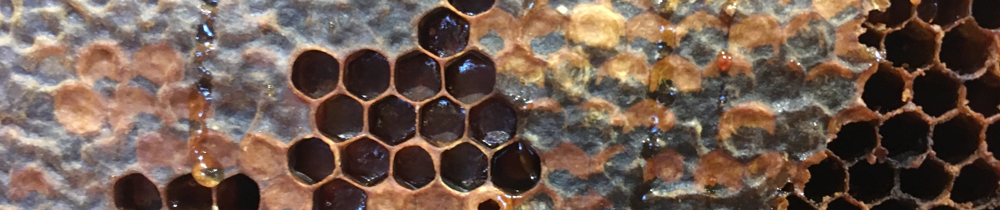

```{r setup, include=FALSE}
knitr::opts_chunk$set(echo = FALSE)

# Learn more about creating websites with Distill at:
# https://rstudio.github.io/distill/website.html

# Learn more about publishing to GitHub Pages at:
# https://rstudio.github.io/distill/publish_website.html#github-pages

```

```{r, out.width = "100%"}

# UPDATE IMAGE HERE 
# or copy/paste this code elsewhere, updating the file path, to add other images to your site!

```

<center>

<p style="color:gray; font-size:15px;">

<i>Honeycomb hex patterns. Photo by <a href="https://unsplash.com/@laughvender?utm_source=unsplash&utm_medium=referral&utm_content=creditCopyText">Shilo Labelle</a> on <a href="https://unsplash.com/s/photos/hexagons?utm_source=unsplash&utm_medium=referral&utm_content=creditCopyText">Unsplash</a>.</i>

</p>

</center>

## Instructor

Allison Horst (ahorst\@ucsb.edu)

## Important links

-   [Course syllabus](https://docs.google.com/document/d/1OGbc6U3STKdsThUKd9Nj5UgzeB7djgM130ku1UUH1gU/edit?usp=sharing)
-   [Code of Conduct](code_of_conduct.html)

## Course description

In EDS 221, students will build key scientific programming skills essential for environmental data analysis and problem solving. Topics include structured programming and algorithm development, iteration, conditionals, functions and objects, documentation, testing and troubleshooting, tidy data structure, and an introduction to data wrangling and visualization. The course will be taught in R and Python.

## Learning objectives

By the end of EDS 221, students should be able to:

-   **Understand, create, and work with different data structures** (e.g. vectors, data frames, lists) **and types** (e.g. numeric, character, factor, logical, date-times)

-   **Design, implement, test and document functions** (including functions with iteration, conditionals, messages and warnings) in R and Python

-   **Use basic (non-collaborative) project-oriented workflows** with reproducible code (R scripts, R Markdown, and Jupyter Notebooks) and version control (git/GitHub basics)

-   **Perform basic data wrangling and visualization** with real world environmental data with tidyverse packages (in R) and pandas/seaborn (in Python)

-   **Employ troubleshooting and debugging strategies** (tools, mindsets, strategies, resources)

## Predictable daily schedule

**Course dates:** Monday (2021-08-09) - Friday (2021-08-20)

EDS 221 is an intensive 2-week long 4-unit course. Students should plan to attend all scheduled sessions. All course requirements will be completed between 8am and 5pm PST (M - F), i.e. you are not expected to do additional work for EDS 221 outside of those hours, unless you are working with the Teaching Assistant in student hours.

::: {style="color: teal;"}
***Note:** For EDS 212 and 221, we will start Wednesdays at 10:00am (instead of 8:00am).*
:::

Tentative daily schedule (subject to change):

| **Time (PST)**    | **Activity**                        |
|-------------------|-------------------------------------|
| 9:00am - 10:00am  | *Lecture 1 (60 min)*                |
| 10:00am - 11:00am | *Interactive Session 1 (60 min)*    |
| 11:00am - 11:10am | *Break (10 min)*                    |
| 11:10am - 12:00pm | *Flex time (50 min)*                |
| 12:00pm - 1:15pm  | *Lunch (75 min)*                    |
| 1:15pm - 2:15pm   | *Lecture 2 (60 min)*                |
| 2:15pm - 3:15pm   | *Interactive Session 2 (45 min)*    |
| 3:15pm - 5:00pm   | *Group & individual tasks (90 min)* |

## Expected sessions (subject to change)

**Note:** lectures and flex sessions will also often include interactive live-coding. You should bring your computer and charger to all sessions in EDS 221.

+--------------------------------------+-----------------------------------------------------------------------------------------------------------------------------------------------------------------------------------------------------------------------------------------------------------------------------------------------------------------+-----------------------------------------------------------------------------------------------------------------------------------------------------------------------------------------------------+----------------------------------------------------------------------------------------------------------------------------------------------------------------------------+----------------------------------------------------------------+
| Day / session                        | Lecture                                                                                                                                                                                                                                                                                                         | **Interactive sessions**                                                                                                                                                                            | **Flex sessions**                                                                                                                                                          | **Activities**                                                 |
+======================================+=================================================================================================================================================================================================================================================================================================================+=====================================================================================================================================================================================================+============================================================================================================================================================================+================================================================+
| Monday 8/9: morning                  | 1.  ["Hello, world": course introduction, programming in EDS, meet our tools](https://docs.google.com/presentation/d/e/2PACX-1vQ9-fDLw5exrrp6tteMXld4ds2aT8dze9XrzgEMuAwgMo-onIVO4lI_vIaE0xXIckacWB1fqXMOF3hl/pub?start=false&loop=false&delayms=3000)                                                          | Capstone Project Proposal Kickoff & Professional Bio with Jamie!                                                                                                                                    | (continued)                                                                                                                                                                | N/A                                                            |
+--------------------------------------+-----------------------------------------------------------------------------------------------------------------------------------------------------------------------------------------------------------------------------------------------------------------------------------------------------------------+-----------------------------------------------------------------------------------------------------------------------------------------------------------------------------------------------------+----------------------------------------------------------------------------------------------------------------------------------------------------------------------------+----------------------------------------------------------------+
| Monday 8/9: afternoon                | 2.  [Project oriented workflows, file paths, naming things,](https://docs.google.com/presentation/d/e/2PACX-1vTRRof4Xrv-cRnthwB2xPK6rtaAFS0WlaCxj4lo3kker2UQnwr9aEB1hiAEiTwfy7NDHXuhCA8wgBQ5/pub?start=false&loop=false&delayms=3000)good habits from the [tidyverse style guide](https://style.tidyverse.org/) | [Meet `here` , project organization, adding data import to our workflow](interactive_sessions/day_1_interactive.html)                                                                               | N/A                                                                                                                                                                        | [Day 1 Activities - Handout](activities/day_1_activities.html) |
+--------------------------------------+-----------------------------------------------------------------------------------------------------------------------------------------------------------------------------------------------------------------------------------------------------------------------------------------------------------------+-----------------------------------------------------------------------------------------------------------------------------------------------------------------------------------------------------+----------------------------------------------------------------------------------------------------------------------------------------------------------------------------+----------------------------------------------------------------+
| Tuesday 8/10: morning                | 3.  [Data representation and types](https://docs.google.com/presentation/d/e/2PACX-1vS5v0KiGyFHu5ThBFYtYS2ObBK_jH94-IQL7cKPWr_SoibKteogW0jSm_vTIXLLsx3sr3Ic9RqiukI3/pub?start=false&loop=false&delayms=3000)                                                                                                    | Creating and exploring [data types](https://swcarpentry.github.io/r-novice-inflammation/13-supp-data-structures/)                                                                                   | TBD                                                                                                                                                                        | N/A                                                            |
+--------------------------------------+-----------------------------------------------------------------------------------------------------------------------------------------------------------------------------------------------------------------------------------------------------------------------------------------------------------------+-----------------------------------------------------------------------------------------------------------------------------------------------------------------------------------------------------+----------------------------------------------------------------------------------------------------------------------------------------------------------------------------+----------------------------------------------------------------+
| Tuesday 8/10: afternoon              | 4.  [Common data types and structures in EDS](https://docs.google.com/presentation/d/e/2PACX-1vQyyk6f975Uraua3mKrjgip7v5tTwgm3-mN5kE5HaOBL3rlBaw_JaB_c64M4H3hLkCdUJE17BGqDpqG/pub?start=false&loop=false&delayms=3000)                                                                                          | Data indexing in [Python](https://jakevdp.github.io/PythonDataScienceHandbook/03.02-data-indexing-and-selection.html) and [R](http://adv-r.had.co.nz/Subsetting.html), parsing & accessing elements | N/A                                                                                                                                                                        | Day 2 Activities - Handout                                     |
+--------------------------------------+-----------------------------------------------------------------------------------------------------------------------------------------------------------------------------------------------------------------------------------------------------------------------------------------------------------------+-----------------------------------------------------------------------------------------------------------------------------------------------------------------------------------------------------+----------------------------------------------------------------------------------------------------------------------------------------------------------------------------+----------------------------------------------------------------+
| Wednesday 8/11: morning (late start) | 5.  [Conditionals and logical operations, intro to for loops](https://docs.google.com/presentation/d/e/2PACX-1vSaVG1shsD0XcHavYIhPJ7aUKUPurCy4bsBEcLdFPjeRtZv3SNnnPsklcUDwswveOQlFcXXbrYRvmFR/pub?start=false&loop=false&delayms=3000)                                                                          | [Refresh logical operations, write basic for loops in R & Python](interactive_sessions/day_3_interactive.html)                                                                                      | *No flex sessions - Wednesday late start*                                                                                                                                  | N/A                                                            |
+--------------------------------------+-----------------------------------------------------------------------------------------------------------------------------------------------------------------------------------------------------------------------------------------------------------------------------------------------------------------+-----------------------------------------------------------------------------------------------------------------------------------------------------------------------------------------------------+----------------------------------------------------------------------------------------------------------------------------------------------------------------------------+----------------------------------------------------------------+
| Wednesday 8/11: afternoon            | 6.  [Loops continued - and functions to help](https://docs.google.com/presentation/d/e/2PACX-1vThIFBj2Bkjs9eYbO3tnrJ8GCd0RBzfHTR9CCq1WWcji6SyXmdW36m8n4ToSPf2nSpj-NtDX4yWJTgR/pub?start=false&loop=false&delayms=3000)                                                                                          | [For loops with conditions, `apply()` functions, and `across()`](interactive_sessions/day_3_interactive.html)\                                                                                      | *No flex sessions - Wednesday late start*                                                                                                                                  | Day 3 Activities - Handout                                     |
|                                      |                                                                                                                                                                                                                                                                                                                 | \                                                                                                                                                                                                   |                                                                                                                                                                            |                                                                |
+--------------------------------------+-----------------------------------------------------------------------------------------------------------------------------------------------------------------------------------------------------------------------------------------------------------------------------------------------------------------+-----------------------------------------------------------------------------------------------------------------------------------------------------------------------------------------------------+----------------------------------------------------------------------------------------------------------------------------------------------------------------------------+----------------------------------------------------------------+
| Thursday 8/12: morning               | 7.  [Introduction to writing functions in R and Python](https://docs.google.com/presentation/d/e/2PACX-1vQI2_jMfAiH4hAVXO8AYE5g8w6iC_N3LIZhZwYYQI5vRRRCwD6_517EkzUU0zwCM2a-BcZvx3YOLyno/pub?start=false&loop=false&delayms=3000)                                                                                | [Functions 101: basics](interactive_sessions/day_4_interactive.html)                                                                                                                                | Customize your {distill} website                                                                                                                                           | N/A                                                            |
+--------------------------------------+-----------------------------------------------------------------------------------------------------------------------------------------------------------------------------------------------------------------------------------------------------------------------------------------------------------------+-----------------------------------------------------------------------------------------------------------------------------------------------------------------------------------------------------+----------------------------------------------------------------------------------------------------------------------------------------------------------------------------+----------------------------------------------------------------+
| Thursday 8/12: afternoon             | 8.  [Functions continued: planning, adding useful messages, more advanced functions and outputs](https://docs.google.com/presentation/d/e/2PACX-1vQE29VZuyRqlbj8F4K-uIyybhmz1_V4ZkHTYj8xW0Xoy6lHLTnclDqb6BXOBnY0YVq1zjgWPnSr-OyZ/pub?start=false&loop=false&delayms=3000)                                       | [Functions 102: beyond basics (functions with conditions, iteration, messages)](interactive_sessions/day_4_interactive.html)                                                                        | *N/A*                                                                                                                                                                      | Day 4 Activities - Handout                                     |
+--------------------------------------+-----------------------------------------------------------------------------------------------------------------------------------------------------------------------------------------------------------------------------------------------------------------------------------------------------------------+-----------------------------------------------------------------------------------------------------------------------------------------------------------------------------------------------------+----------------------------------------------------------------------------------------------------------------------------------------------------------------------------+----------------------------------------------------------------+
| Friday 8/13: morning                 | 9.  [Functions continued: testing, documentation, sharing](https://docs.google.com/presentation/d/e/2PACX-1vS8CQzC_y4PsFmB_33FX3AW2TkteXIerAiClkaO_TUnAxs4aaDCQ6kAz53pgdtA7AIKhTRWI9uHDFfo/pub?start=false&loop=false&delayms=3000)                                                                             | [Functions 103: testing & documenting functions, making your first package](interactive_sessions/day_5_interactive.html)                                                                            | Functions, continued                                                                                                                                                       | N/A                                                            |
+--------------------------------------+-----------------------------------------------------------------------------------------------------------------------------------------------------------------------------------------------------------------------------------------------------------------------------------------------------------------+-----------------------------------------------------------------------------------------------------------------------------------------------------------------------------------------------------+----------------------------------------------------------------------------------------------------------------------------------------------------------------------------+----------------------------------------------------------------+
| Friday 8/13: afternoon               | 10. [Finding & using external packages](https://docs.google.com/presentation/d/e/2PACX-1vRiEkcimIxqblQ4j2vhnp9ys1J5zoEjls7eGZuwUPa46NNYqJlT9FO2GfDuU5o3v96tYJMGeMbviUR0/pub?start=false&loop=false&delayms=3000)                                                                                                | [Find & explore packages, documentation, accessing from repos](interactive_sessions/day_5_interactive.html)                                                                                         | Find a package, present a function (professional skills activity)                                                                                                          | Day 5 Activities - Handout                                     |
+--------------------------------------+-----------------------------------------------------------------------------------------------------------------------------------------------------------------------------------------------------------------------------------------------------------------------------------------------------------------+-----------------------------------------------------------------------------------------------------------------------------------------------------------------------------------------------------+----------------------------------------------------------------------------------------------------------------------------------------------------------------------------+----------------------------------------------------------------+
| Monday 8/16: morning                 | 11. [Tidy data: what, why, how?](https://docs.google.com/presentation/d/e/2PACX-1vRWyQuDd6xnppypSe3jrfpJXiG4eWrfeU2kvCg5ACDO-QWpd-rZI1QR3B-HsBZcQxjK6iVjJzjuXiQq/pub?start=false&loop=false&delayms=3000)                                                                                                       | [Tidying data (pivot, separate) basics with `tidyr` and `pandas`](interactive_sessions/day_6_interactive.html)                                                                                      | Importing data continued with `readr` and `readxl` , and some of my favorite data cleaning tools                                                                           |                                                                |
+--------------------------------------+-----------------------------------------------------------------------------------------------------------------------------------------------------------------------------------------------------------------------------------------------------------------------------------------------------------------+-----------------------------------------------------------------------------------------------------------------------------------------------------------------------------------------------------+----------------------------------------------------------------------------------------------------------------------------------------------------------------------------+----------------------------------------------------------------+
| Monday 8/16: afternoon               | 12. [Data tidying and wrangling continued: `dplyr` and `pandas`](https://docs.google.com/presentation/d/e/2PACX-1vQzpRoRVgTkOiyIuwTlH2I0plPD8ELFGou_JXez2o67w9brhXI_mlImcarJhJYY6SbLtxvUsxlQdsoe/pub?start=false&loop=false&delayms=3000)                                                                       | [Data wrangling continued - `dplyr` and `pandas`](interactive_sessions/day_6_interactive.html)                                                                                                      | N/A                                                                                                                                                                        |                                                                |
+--------------------------------------+-----------------------------------------------------------------------------------------------------------------------------------------------------------------------------------------------------------------------------------------------------------------------------------------------------------------+-----------------------------------------------------------------------------------------------------------------------------------------------------------------------------------------------------+----------------------------------------------------------------------------------------------------------------------------------------------------------------------------+----------------------------------------------------------------+
| Tuesday 8/17: morning                | 13. [Data wrangling continued - more tidying, relational data & types of joins](https://docs.google.com/presentation/d/e/2PACX-1vTXGSmMDyPisd8hsAOm6qImorlHOrqQMF0VjZPaWTP65Eb9gmB7xLC7-WZjpq_warkNN0RiY_D_fRHh/pub?start=false&loop=false&delayms=3000)                                                        | [Data wrangling continued: joins](interactive_sessions/day_7_interactive.html)                                                                                                                      | Group read & report back: [An introduction to designing accessible data visualizations](https://fossheim.io/writing/posts/accessible-dataviz-design/) by Sarah L. Fossheim |                                                                |
+--------------------------------------+-----------------------------------------------------------------------------------------------------------------------------------------------------------------------------------------------------------------------------------------------------------------------------------------------------------------+-----------------------------------------------------------------------------------------------------------------------------------------------------------------------------------------------------+----------------------------------------------------------------------------------------------------------------------------------------------------------------------------+----------------------------------------------------------------+
| Tuesday 8/17: afternoon              | 14. [Data wrangling continued - working with dates & times, wrangling strings](https://docs.google.com/presentation/d/e/2PACX-1vRrM6QW1C-xjU_8e6Uuy5ZlCXtWsXZAkK7BzQdEWuq93ac_Y8oaKaL1VAbP4fJBfQr41fGpoBsfZcqI/pub?start=false&loop=false&delayms=3000)                                                         | [Data wrangling continued: dates, times, strings](interactive_sessions/day_7_interactive.html)                                                                                                      | Meet your next instructor: Welcome Dr. Julien Brun!                                                                                                                        |                                                                |
+--------------------------------------+-----------------------------------------------------------------------------------------------------------------------------------------------------------------------------------------------------------------------------------------------------------------------------------------------------------------+-----------------------------------------------------------------------------------------------------------------------------------------------------------------------------------------------------+----------------------------------------------------------------------------------------------------------------------------------------------------------------------------+----------------------------------------------------------------+
| Wednesday 8/18: morning (late start) | 15. The grammar of graphics                                                                                                                                                                                                                                                                                     | Data visualization in `ggplot2` and `seaborn`                                                                                                                                                       | *No flex session - Wednesday late start*                                                                                                                                   |                                                                |
+--------------------------------------+-----------------------------------------------------------------------------------------------------------------------------------------------------------------------------------------------------------------------------------------------------------------------------------------------------------------+-----------------------------------------------------------------------------------------------------------------------------------------------------------------------------------------------------+----------------------------------------------------------------------------------------------------------------------------------------------------------------------------+----------------------------------------------------------------+
| Wednesday 8/18: afternoon            | 16. Data visualization - considerations                                                                                                                                                                                                                                                                         | Data viz continued, accessibility tools, alt-text                                                                                                                                                   | *No flex session - Wednesday late start*                                                                                                                                   |                                                                |
+--------------------------------------+-----------------------------------------------------------------------------------------------------------------------------------------------------------------------------------------------------------------------------------------------------------------------------------------------------------------+-----------------------------------------------------------------------------------------------------------------------------------------------------------------------------------------------------+----------------------------------------------------------------------------------------------------------------------------------------------------------------------------+----------------------------------------------------------------+
| Thursday 8/19: morning               | 17. Troubleshooting (exploring, Googling, getting help, helping yourself)                                                                                                                                                                                                                                       | Directed debugging: strategies & pitfalls                                                                                                                                                           | Rubber ducky debugging activities (and read Maelle's [blog post](https://masalmon.eu/2021/07/13/code-detective/))                                                          |                                                                |
+--------------------------------------+-----------------------------------------------------------------------------------------------------------------------------------------------------------------------------------------------------------------------------------------------------------------------------------------------------------------+-----------------------------------------------------------------------------------------------------------------------------------------------------------------------------------------------------+----------------------------------------------------------------------------------------------------------------------------------------------------------------------------+----------------------------------------------------------------+
| Thursday 8/19: afternoon             | 18. Troubleshooting continued (tracing, reprex)                                                                                                                                                                                                                                                                 | Search, debug, present - common code "gotchyas"                                                                                                                                                     | Panel discussion with leaders from SB data science communities                                                                                                             |                                                                |
+--------------------------------------+-----------------------------------------------------------------------------------------------------------------------------------------------------------------------------------------------------------------------------------------------------------------------------------------------------------------+-----------------------------------------------------------------------------------------------------------------------------------------------------------------------------------------------------+----------------------------------------------------------------------------------------------------------------------------------------------------------------------------+----------------------------------------------------------------+
| Friday 8/20: morning                 | 19. Wrangling wild data: Working with data from external files and accessing data, get started cleaning                                                                                                                                                                                                         | Wild data import - accessing data from EDI with `metajam`                                                                                                                                           | Revisiting our expanded DS skills Venn diagram                                                                                                                             |                                                                |
+--------------------------------------+-----------------------------------------------------------------------------------------------------------------------------------------------------------------------------------------------------------------------------------------------------------------------------------------------------------------+-----------------------------------------------------------------------------------------------------------------------------------------------------------------------------------------------------+----------------------------------------------------------------------------------------------------------------------------------------------------------------------------+----------------------------------------------------------------+
| Friday 8/20: afternoon               | 20. Wild data continued                                                                                                                                                                                                                                                                                         | Wild data continued                                                                                                                                                                                 | *No flex - 15 minute break before work session*                                                                                                                            |                                                                |
+--------------------------------------+-----------------------------------------------------------------------------------------------------------------------------------------------------------------------------------------------------------------------------------------------------------------------------------------------------------------+-----------------------------------------------------------------------------------------------------------------------------------------------------------------------------------------------------+----------------------------------------------------------------------------------------------------------------------------------------------------------------------------+----------------------------------------------------------------+

## Course requirements

### Computing

-   Minimum [MEDS device requirements](https://ucsb-meds.github.io/computer_reqs.html) (bring to all sessions + charger!)

-   R version 4.0.2 (or higher)

-   RStudio version 1.4.1103 (or higher)

## About this website

This website was created with gratitude using [distill](https://rstudio.github.io/distill/) from [RStudio](https://www.rstudio.com/) by JJ Allaire, Rich Iannone, Alison Presmanes Hill, and Yihui Xie.

This website is one piece of the EDS 221 course materials in addition to lectures, computational activities, discussions, and individual and group tasks, and important materials may exist partially or not at all on this site. While this website is public, it is not meant as a standalone online course.

Other packages used to create this website:

-   `rmarkdown` for...pretty much everything: JJ Allaire and Yihui Xie and Jonathan McPherson and Javier Luraschi and Kevin Ushey and Aron Atkins and Hadley Wickham and Joe Cheng and Winston Chang and Richard Iannone (2021). rmarkdown: Dynamic Documents for R. R package version 2.7. URL <https://rmarkdown.rstudio.com>
